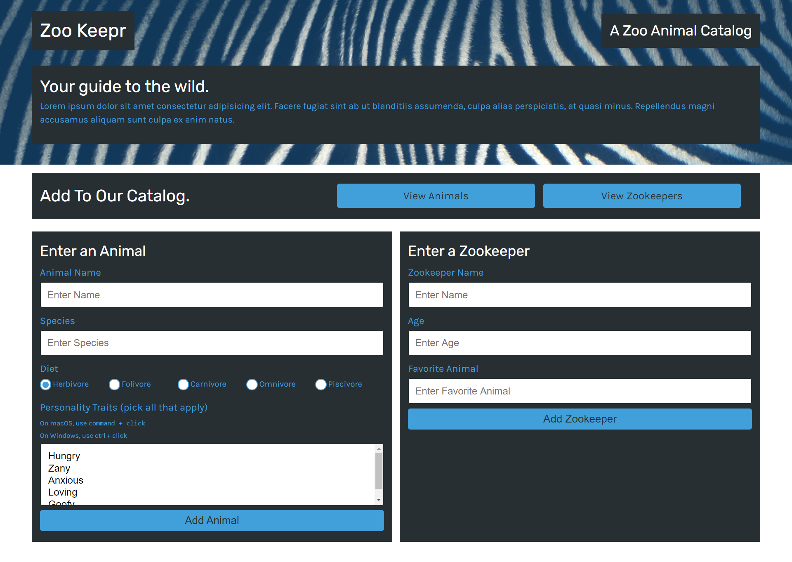
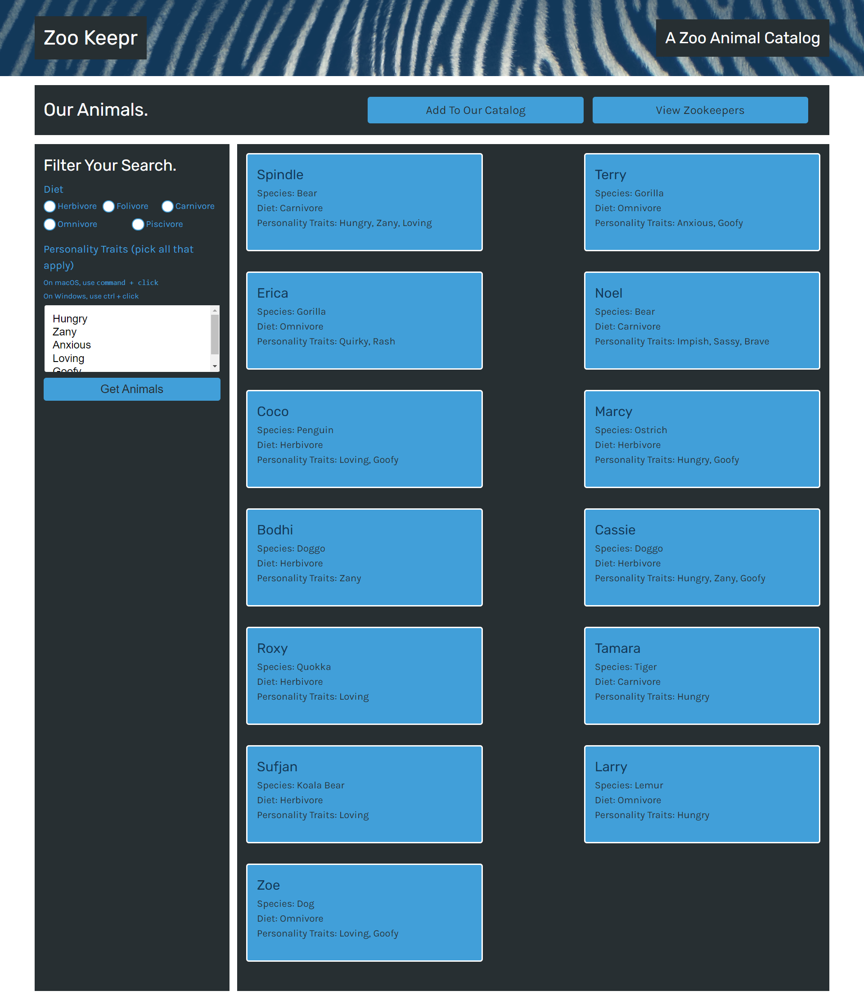
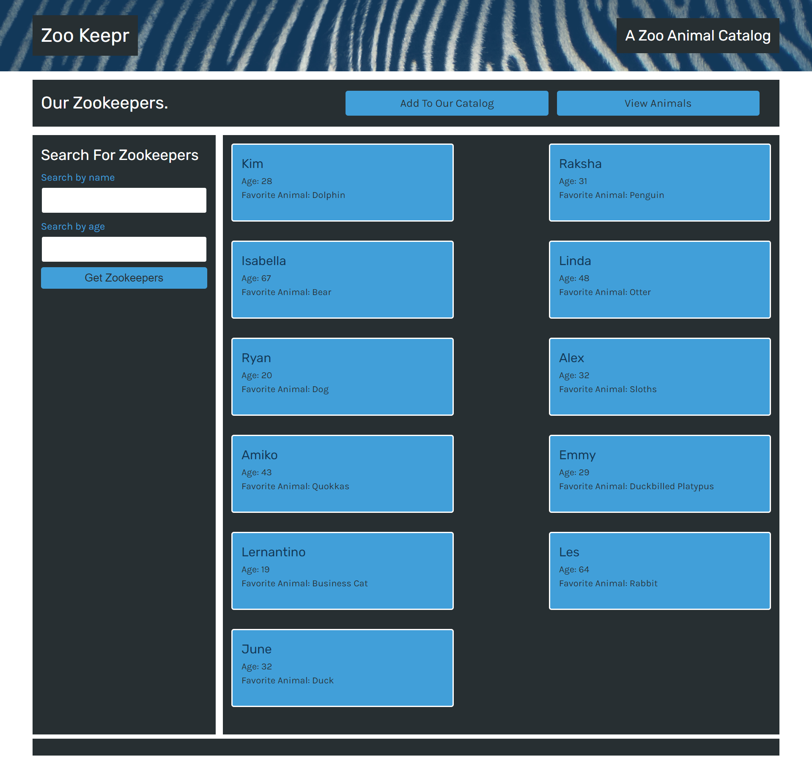

# Zookeepr
  

## Description
Zookeepr is an Express.js application for cataloguing zoo animals and tracking zookeepers.
            
View the deployed page at [Zookeepr](https://deckiedevs-zookeepr.herokuapp.com).

## Contents
* [Usage](#usage)
   * [Screenshots](#screenshots)
* [Built With](#built-with)
* [Questions](#questions)
* [Credits](#credits)

## Usage
From the home page, users can add to the animal and zookeeper catalog by filling out the appropriate forms.  Existing zoo animals and zookeepers can be viewed on the respective web pages.  Animals and zookeepers can be searched using filter parameters found on the left-hand side of the catalog page. 
    
### Screenshots

Users can add animals and zookeepers on the Zookeepr homepage.

Users can view animals currently in the zoo's catalog and can filter their search results by diet and personality traits.

Users can view zookeepers currently employed by the zoo and can filter their search results by the zookeeper's name and age.

## Built With
* HTML
* CSS
* JavaScript
* Node.js
* Express.js
    
## Questions
If you have any questions about the repo, please [open an issue](https://github.com/deckiedevs/zookeepr/issues) or contact me via email at deckiedevs@gmail.com. You can find more of my work on my GitHub, [deckiedevs](https://github.com/deckiedevs/).
    
## Credits
* Front-end code (HTML and CSS) provided by the UCF Coding Boot Camp.
* Back-end coded by Mila Decker.